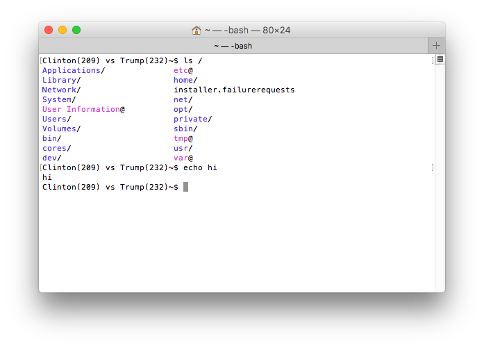

# bash-prompt-usa_president_2016

Indicate USA President 2016 in Bash prompt

Inspired by: https://github.com/mattn/vim-usa_president_2016



## Usage

```shell
source ./bash-prompt-usa_president_2016
```

## License

MIT

## Author

Tsuneo Yoshioka
